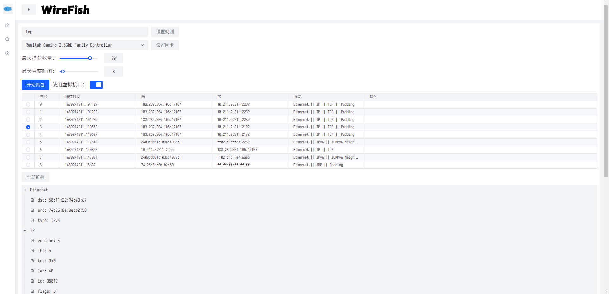
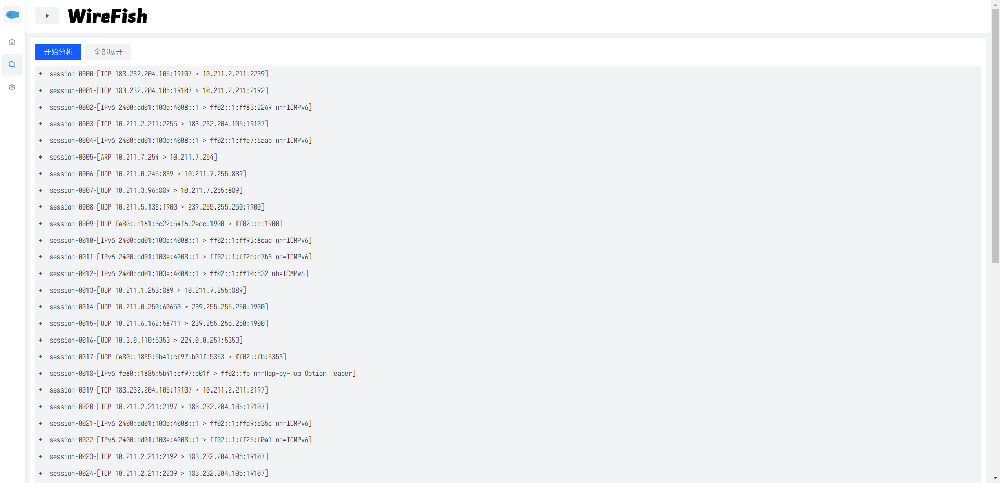

# WireFish

## 概要

国科大网络攻防基础大作业一号（2023）

WireFish项目的前端架构，使用Vue3框架+Vite4构建工具，网络通信使用Axios，模拟调试使用Mock

## 运行环境

系统：Windows

编译器/解释器：Node16

网络端口：部署在另一个前端服务器运行

## 主要依赖

### 生产环境

* vue：前端框架
* axios：网络通信
* mockjs：模拟调试

### 开发环境

* arco-design：字节跳动的UI库
* vite：快速项目构建工具

## 基本结构

* ./dist：由vite打的包，用于在前端服务器上进行快速部署
* ./node_modules：依赖库
* ./public：资源文件
* ./src：源码和资源
    * ./src/assets：资源文件，放了一些图标和字体
    * ./src/components：我写的一些子组件
    * ./src/mock：用来拦截请求做调试的逻辑和模拟响应文件
    * ./src/plugins：插件，目前只放了axios的相关配置
    * ./src/style.css：全局样式表
    * ./src/main.js：程序入口
    * ./src/app.vue：根组件
* ./vite.config.js：项目构建的配置文件
* ./package.json：依赖项和命令
* ./index.html：页面入口

## 功能展示

### 抓包界面

功能包括：

* 可折叠菜单：侧边栏可以通过顶栏的按钮展开或者折叠，可以从侧边栏选择界面，页面切换之后另一个界面的数据仍会保留

* 设置抓包过滤器
* 设置网卡
* 调整最大抓包数量
* 调整抓包超时时间
* 选择是否使用虚拟接口：若使用虚拟接口，则从mock返回结果，反之从后端服务器接受结果
* 开始抓包：每两秒进行一次增量更新，直到抓包完成或者超时，每次抓包开始后会清除数据包列表和数据包详情以及数据包分析界面的数据
* 数据包列表：显示序号、捕获时间、源地址/端口、宿地址/端口、协议栈、其他，可以手动调整每列的宽度并选中某一行数据
* 数据包详情：选择列表中的某一个数据包之后，会显示树状结构，列出每层协议的所有属性
* 数据包详情折叠：可以快速展开和收起数据包详情的树状结构，在没有选中某个数据包时不会显示

### 分析界面

功能包括：

* 分析报文：按照session拆分在抓包界面捕获的数据包，并以树状结构展示
* 数据包分析折叠：可以快速展开和收起数据包分析的树状结构，在没有进行分析时不会显示
